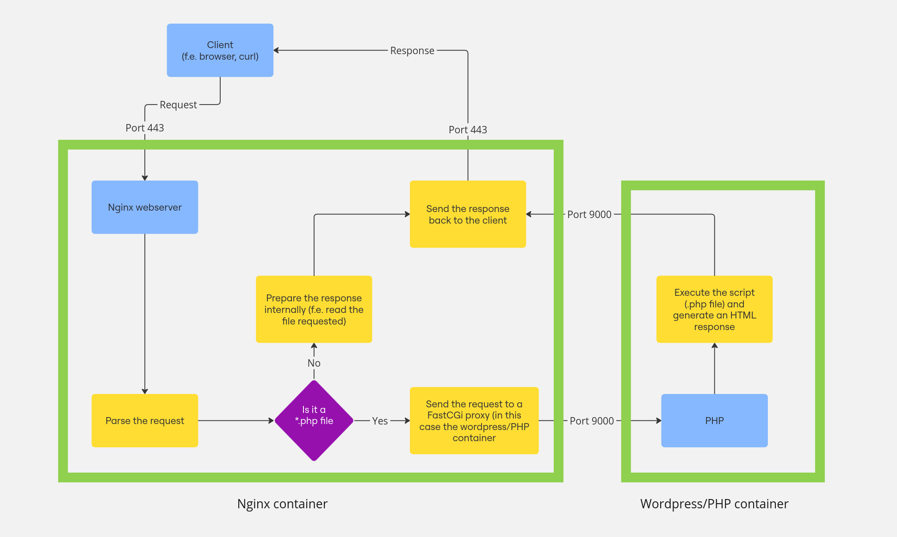

# Nginx

## Disclaimer

For some of this to make sense, you'll need some knowledge about [Dockerfiles](../README.md).

## Contents

1. [Nginx explanation](#1-nginx-explanation)
	- [Short](#11-short)
	- [Long](#12-longerish-explanation)
	- [Flowchart](#13-flowchart)
2. [Nginx setup](#2-nginx-setup)
	- [Nginx configuration file](#21-nginx-configuration-file)
	- [Nginx Dockerfile](#22-nginx-dockerfile)
	- [Nginx docker-compose](../../README.md#nginx)
	- [Pitfalls](#23-pitfalls)
3. [SSL/TLS certificate](#3-ssltls-certificate)

### 1. Nginx explanation

I won't explain all the theory behind this like HTTP requests and responses, the difference between HTTP and HTTPS, what webservers are etc. If you're interested the Internet is your friend.  
There are some references to PHP and wordpress in this doc, more about those [here](../wordpress/README.md)
Honestly you can skip this whole section if you don't care or already know this from webserv.

#### 1.1. Short

Nginx is the webserver of our stack. It's the point of entry to our infrastructure. In short, nginx is the program that receives the requests from clients, parses them, decides what needs to be done with them and then sends back a response to the client.  
We can configure nginx's behaviour with a [config file](#21-nginx-configuration-file)

#### 1.2. Longerish explanation

Whenever you type an address in your browser, you are sending a request to a webserver. To keep it simple let's just say you're requesting a page from the webserver. The page is written in HTML code, this code will be in a file somewhere on some computer. In our case these files are on the machine running the webserver.  
So essentially what Nginx does is that it receives the request, parses it, and then checks what the client asks for. Lets say it's file "x", Nginx will then look for file "x" in it's directory structure, read it and send the contents back to the client, which then displays that content.<br>

Now, noone is writing the content of all the webpages in the world manually. Let's say you have a page showing which hour it is. This doesn't mean you have 24 different files, each with a different hour. You will probably have one file with a script/function that runs to check what hour it is.  
Unfortunately Nginx is stupid and doesn't understand that there is a function in there. This is where PHP comes in, a scripting language that can read that file, run any functions in the file and use that to generate HTML code that will represent the page. In our case it will check what hour it is and just put a number in the HTML code.<br>

By default Nginx won't recognise these scripts (dynamic content). So we configure Nginx to use a proxy or FastCGI (dunno if these terms are interchangable, sue me). This means that Nginx instead of reading the file and just serving it back (static content) will ask a different program to process the file (dynamic content). Once it's done Nginx will send back the hard work of the other program to the client.<br>

In our case, the proxy is a different container, the [wordpress/php container](../wordpress/README.md). Now, you probably haven't set it up yet, so displaying dynamic content won't be possible, but that comes later.  
You might ask, how does Nginx differentiate between static and dynamic content. Well, we need to tell it through the configuration file. By default everything requested will be served statically as is. In our case we setup a rule that states if the file has a `.php` extension, then we send it to our proxy for processing. In theory you can do this for different kind of files as well, like `.py` files etc.  
How to do all this will be in the [next segment](#21-nginx-configuration-file).<br>

#### 1.3. Flowchart



This is a simplified flowchart, a lot more happens, but for the purposes of the project and this container I hope it's enough to get an idea.<br>

A full flowchart of the infrastructure is available in the [docker-compose readme](../../README.md#flowchart).

### 2. Nginx setup

For the Nginx container we will only need a Dockerfile and a configuration file. The config file will have all the requirements from the subject in it and tell nginx how to communicate with the wordpress container.  
You can start with the Dockerfile since it's pretty standalone and works without the config file and then add the config file later.  
Once you have both of these you can test nginx by itself. Just start it up with a [docker](ADD-LINK) and connect to it with your browser on `https://localhost:443`. It will prompt you saying it's a self-signed certificate which you can ignore. If you haven't set up volumes and worpress yet it will probably be a 404. If you want you can [exec](ADD-LINK) into the container, make an index.html file in /var/www/html and it should display that one.

#### 2.1. Nginx configuration file

The config file already has short explanations. You can learn more here or just skip this section.
I'll explain the various lines from the configuration file in more detail here.  
The config file for reference:
```nginx
server {
	listen 443 ssl;
	listen [::]:443 ssl;
	server_name	jmolenaa.42.fr;
	
	ssl_protocols TLSv1.2 TLSv1.3;
	ssl_certificate /ssl_cert;
	ssl_certificate_key /ssl_key;

	root /var/www/html;
	index index.php index.html;


	location ~ \.php$ {
		fastcgi_pass wordpress:9000;
		fastcgi_index index.php;
		include fastcgi_params;
		fastcgi_param SCRIPT_FILENAME $document_root$fastcgi_script_name;
	}
}
```
- **`listen 443 ssl;`** – Sets the server to listen on port 443 for IPv4 connections and enables SSL/TLS encryption.  
- **`listen [::]:443 ssl;`** – Sets the server to listen on port 443 for IPv6 connections and enables SSL/TLS encryption.
- **`server_name jmolenaa.42.fr;`** – Specifies the domain name that this server will handle requests for.  
<br>

- **`ssl_protocols TLSv1.2 TLSv1.3;`** – Specifies which [TLS](#3-ssltls-certificate) versions are allowed.  
- **`ssl_certificate /ssl_cert;`** – Defines the path to the TLS/SSL certificate file.
- **`ssl_certificate_key /ssl_key;`** – Defines the path to the private key associated with the TLS/SSL certificate. We'll create these files in the [Dockerfile](#22-nginx-dockerfile). If you decide to change where we create them, these paths need to be adjusted.
<br>

- **`root /var/www/html;`** – Sets the document root where website files (HTML, PHP, etc.) are stored. This is where we will mount our [volume](../../README.md#volumes) that contains our Wordpress website files.
- **`index index.php index.html;`** – Defines the default files to be served when a directory is requested. Nginx will try `index.php` first, then `index.html`.  
<br>

- **`location ~ \.php$ {`** – Defines a location block that handles all requests ending in `.php` (e.g., `index.php`).  
- **`fastcgi_pass wordpress:9000;`** – Forwards PHP requests to PHP-FPM running in a container named `wordpress` on port 9000.  
- **`fastcgi_index index.php;`** – Specifies that `index.php` should be used as the default file for directory requests in FastCGI.  
- **`include fastcgi_params;`** – Loads predefined FastCGI parameters, which help pass request details (like headers and environment variables) to PHP-FPM.  
- **`fastcgi_param SCRIPT_FILENAME $document_root$fastcgi_script_name;`** – Sets the full path of the PHP script to be executed by PHP-FPM. It combines the `document_root` (`/var/www/html`) with the requested script name (f.e. `index.php`).  

There is a lot of stuff here that you might understand better if you've done the webserv project. If not, a complete knowledge of this is probably not required and just kind of knowing these things is fine. You can always choose to learn more though.

#### 2.2. Nginx Dockerfile

So again, you'll probably need some [Dockerfile](../README.md) knowledge to get through this one.  
I'll just explain line by line what the Dockerfile does and why we do it. It follows the [order](ADD-LINK) of operations, so just learn th general order of stuff and then the Dockerfile should make a lot of sense.  
Dockerfile for reference:
```Dockerfile
FROM alpine:3.20

RUN apk update && apk add \
		bash \
		nginx \
		openssl

# generates a SSL key and certificate
RUN openssl req -x509 -nodes -days 365 -newkey rsa:2048 \
	-keyout /ssl_key \
	-out /ssl_cert \
	-subj "/C=NL/L=Amsterdam/O=CODAM/OU=student/CN=jmolenaa.42.fr"

# copying to http.d cause that's where virtual server blocks should be located for alpine nginx
COPY ./conf/nginx.conf /etc/nginx/http.d/default.conf

# expose is more of a documentation thing, doesnt actually expose stuff
EXPOSE 443
# entrypoint since we always just want to start with nginx and it running in foreground
# this is to run nginx as not a daemon, but the main process in the container
ENTRYPOINT ["nginx", "-g", "daemon off;"]
```

- **`FROM alpine:3.20`** - This line defines the base image that we use for our container. I use Alpine instead of Debian, cause it is more lighter and barebones, therefore it also downloads and builds faster.
- **`RUN apk update && apk add bash nginx openssl`** - This line runs apk (package manager for Alpine) inside the container to install the necessary packages for nginx to work.  
We need nginx itself installed.
openssl is installed so we can generate a [SLL/TLS certificate](#3-ssltls-certificate).
And bash just so you can exec into the container to debug and check what's happening.
- **`openssl req -x509 -nodes -days 365 -newkey rsa:2048 -keyout /ssl_key -out /ssl_cert -subj "/C=NL/L=Amsterdam/O=CODAM/OU=student/CN=jmolenaa.42.fr"`** - This line runs the openssl command to generate a SSl/TLS certificate for our website. More about it [here](#3-ssltls-certificate)
- **`COPY ./conf/nginx.conf /etc/nginx/http.d/default.conf`** - This line copies the configuration file we created into the container in spot `/etc/nginx/http.d/default.conf`. This is where nginx stores configuration files for servers and it will automatically read it on startup. On debian this location is different btw.
- **`EXPOSE 443`** - Exposes port 443. This line I think is unnecessary, since we'll be exposing this port in the docker-compose file. It's mostly there for documentation, people reading the Dockerfile will know right away that this port is exposed.
- **`ENTRYPOINT ["nginx", "-g", "daemon off;"]`** - This line defines what command should be ran when the container starts up. In the case of nginx we don't require any more setup after what the Dockerfile already did, so we just start up nginx. Since nginx by default is a daemon (runs in the background) we need to add the option `-g daemon off`, which starts up nginx in the foreground as the main process running in the container. If this option isn't there the container will start up nginx, nginx will put itself in the background as a new process, and then the container will stop. If you're curious just use `ENTRYPOINT ["nginx"]` and see what happens.

This is honestly it I think for nginx. As long as you keep the Dockerfile and the config file the same I don't think there is amny ways this container can cause bugs.

#### 2.3. Pitfalls

This is just some things you can check if something doesn't work as expected:
- **TYPOS**
- If you already have docker-compose check if the volume is mounted correctly and if the port forwarding is there as well. If you're just trying to run the Dockerfile, you'll have to forward the ports [manually](ADD-LINK) when running the container.
- Is the path where you generate the keys with opensll (specifically the -keyout and -out portions of the command) the same as the path you specify in the configuration file.
- Just check if the paths for everything are correct, like the `root` directive in the config file or the `COPY` command and if it's copying the config file into the right spot
- Check if you changed my login with yours in the spots where you need to like in the `openssl req -x509 -nodes -days 365 -newkey rsa:2048 -keyout /ssl_key -out /ssl_cert -subj "/C=NL/L=Amsterdam/O=CODAM/OU=student/CN=jmolenaa.42.fr"` command. You should change the `jmolenaa` to whatever you are.

### 3. SSL/TLS certificate

So this certificate is just a way of telling the client connecting to your website that the connection is encrypted and therefore a third party can't read whatever you're sending. This does not mean your website is safe, because you might still be a bad actor. It means you're safe from third parties but not necessarily from the owner of the website. This is why you will get a warning for self-signed certificates cause they don't really mean anything.  
Now, getting a certificate form an authority costs money so you don't have to do that for Inception.  
SSL and TLS aren't really interchangable, but they both serve the same purpose of securing communications. TLS is more modern and more secure so that's the one used most of the time and when people say SSL/TLS they usually mean TLS.  
So to explain this **`openssl req -x509 -nodes -days 365 -newkey rsa:2048 -keyout /ssl_key -out /ssl_cert -subj "/C=NL/L=Amsterdam/O=CODAM/OU=student/CN=jmolenaa.42.fr"`**  
So this command generates the certificate also specifying some options for it:  
- `x509` - specifies the certificate will be self signed
- `-nodes` - don't encrypt the private key (no password)
- `-days 365` - certificate valid for 365 days
- `newkey rsa:2048` - creates a key and associates it with the certificate, uses 2048-RSA for creation
- `-keyout` and `-out` - specify the output files for the key and the certificate respectively
- `subj` - allows you to specify the details of the certificate, like country, domain name, etc. directly through the command instead of being prompted interactively  

The important thing here is that in `openssl req -x509 -nodes -days 365 -newkey rsa:2048 -keyout /ssl_key -out /ssl_cert -subj "/C=NL/L=Amsterdam/O=CODAM/OU=student/CN=jmolenaa.42.fr"` you should change the very last field `CN=jmolenaa.42.fr"` to whatever your intra login would be.

